
A sort-of blog about my project 2007 Subaru Forester

‎
‎

The first photos of the Forester! I purchased her in December 2019 from a family who had enough cars and needed to downsize. No noticeable problems at 147,000 miles and cost $3k. I named her Janice, which seemed fitting for a granny car and at this point I had no idea to what she would become.

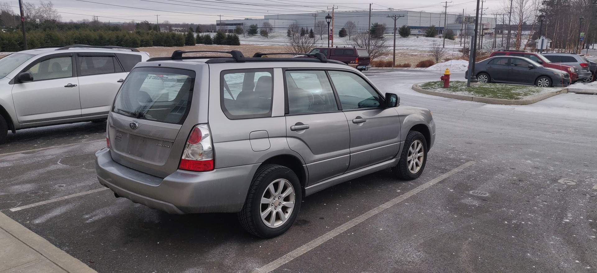
Once I took her home I knew I wanted her to be a bit beefier and be somewhat off-road capable. Ordered a cheap $100 roof rack from China and struggled to put it together without instructions but it looks good and saved a lot of money.
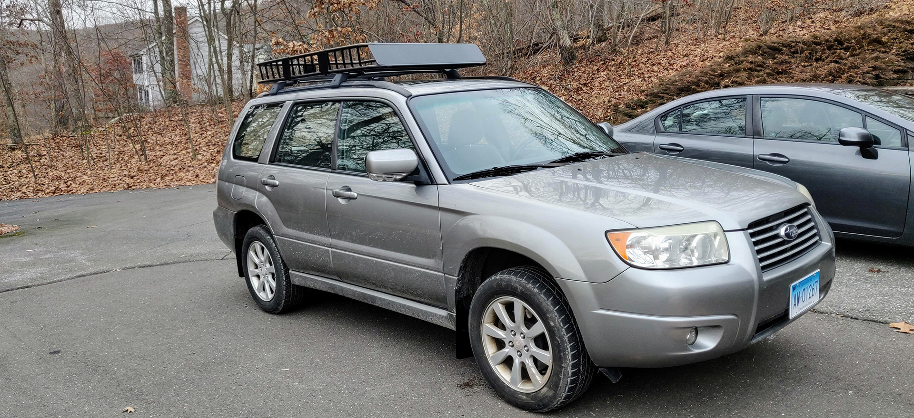
When I got her I knew she'd need new tires soon, so before winter break ended I put on some 215/65/r16 General Grabbers new from Walmart. Worst customer service experience I've ever had, but 4 weeks later I had some new shoes. In retrospect, I wish I had gotten larger tires since I was buying new and would eventually find these too small.

Janice got about a two month hiatus while I focused on my studies at uni, but right before I knew I couldn't stand the audio so it was time for a sound upgrade. I installed a bluetooth headunit with voice controls and new speakers all around. I opted for cheap BOSS speakers in the doors which I was told I would regret, but even after 6 month I have seen no problems with them. I also got an all-in-one subwoofer and amp to install under the trunk panel where the jack was stored. I cut a plywood panel to cover where I removed the foam panel, but had to constantly cover it with a blanket to prevent rattle. Eventually I modified the original foam insert to fit over the sub and be able to open up to uncover when that little bit more bass was needed.
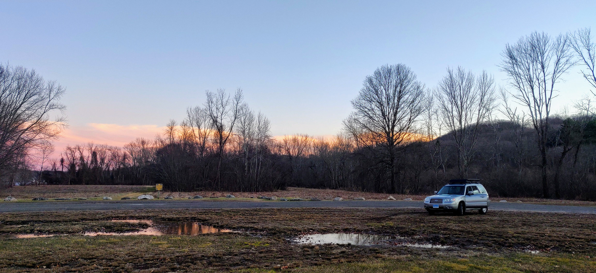
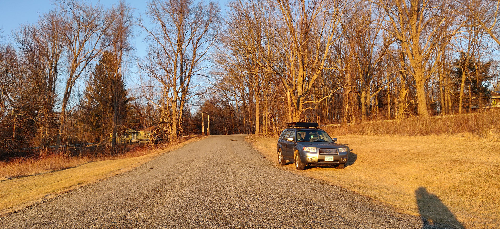
Didn't do much modding in this time and didn't feel the need to, but Janice had some good adventures. The photos below I refer to as 'Fire and Ice', and were only a week apart. Completely unintentional. It was also this time that I finally realized that a rear headrest was missing (how do you lose that?) so I looked for a while but found the right color on ebay for only $40.

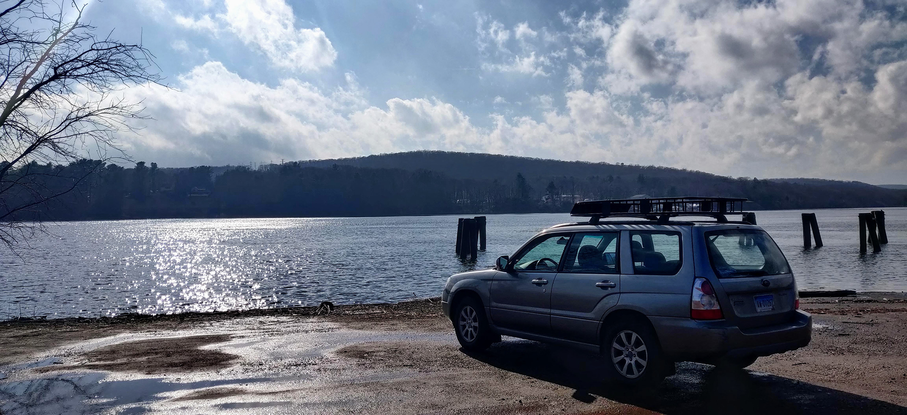
As the Covid-19 outbreak hit the US, I was sent home from uni and had a lot of spare time. I decided to paint some parts of the car to give a more aggressive look. Started with the front bumper as shown below but added skirts, mirror caps, gas cap, and C pillar to all black.
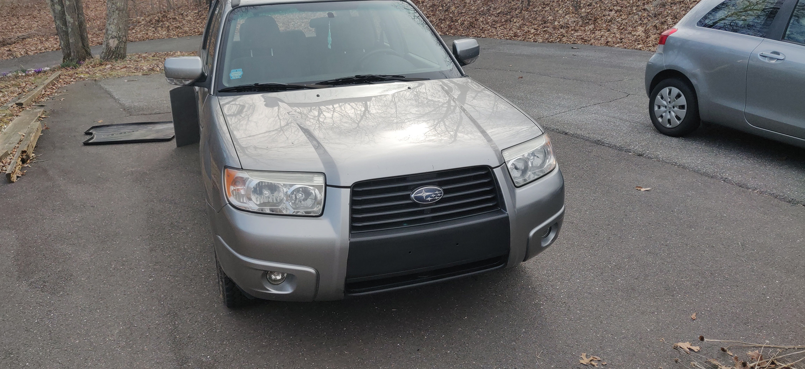
Since I had been helping my brother build his dream jeep (left) for a while, some mods that were done to it would also be done to the new forester. This silly photo shows our new light bars. Janice got four pod flood lights on her roof rack, wired with a relay. I wish that I had made the center two spot lights but did not initially because they were slightly more expensive. These were all cheap Nilight brand but worked great for our purposes.

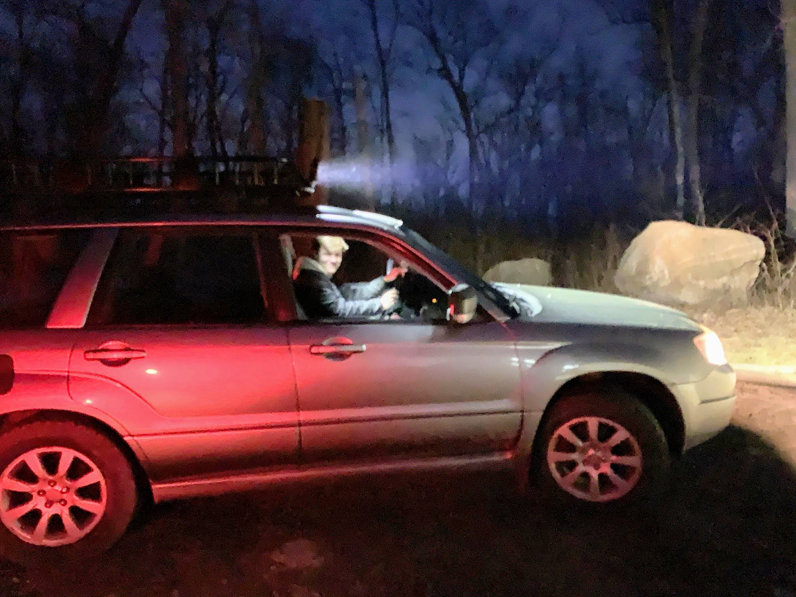
It was my first time camping since the forester and I decided it would be more comfortable to sleep in the back with the seats folded down. While being 5'10" I surely had enough space and was warm, the trunk is not comfortable to lay on. If to be done again, would need a real mattress pad.

I had planned to plastidip the rims since I got the car, but the silver looked fine so I delayed. Eventually spring came closer so it was the first opportunity for proper drying and I took it. I had purchased metalizer and planned for an anthracite grey finish, but once the black coats went on I noticed how well they fit the color scheme of the car, and that is what I still have today.

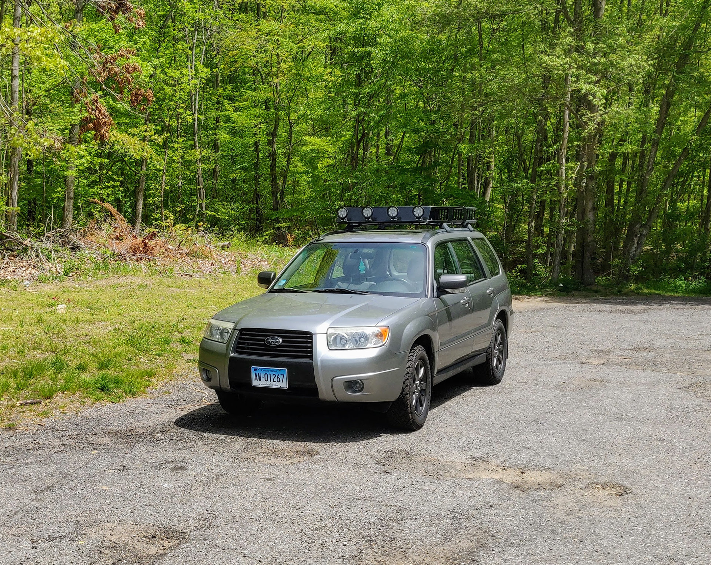
150k!! So proud of her! At this point only repairs that had been done in my possession were fluid changes, new timing belts, idle pulley bolt, and air filters. I didn't realize it would be in the next 2k miles we'd lose the AC compressor clutch and drivers door window motor, but both were repaired alone very inexpensively.
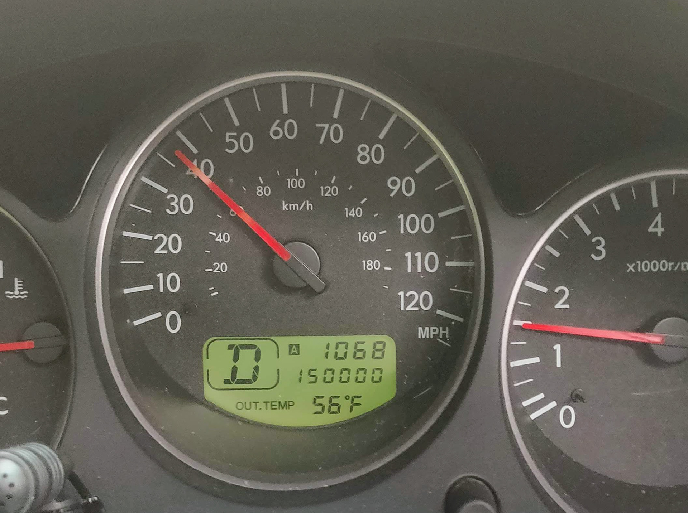
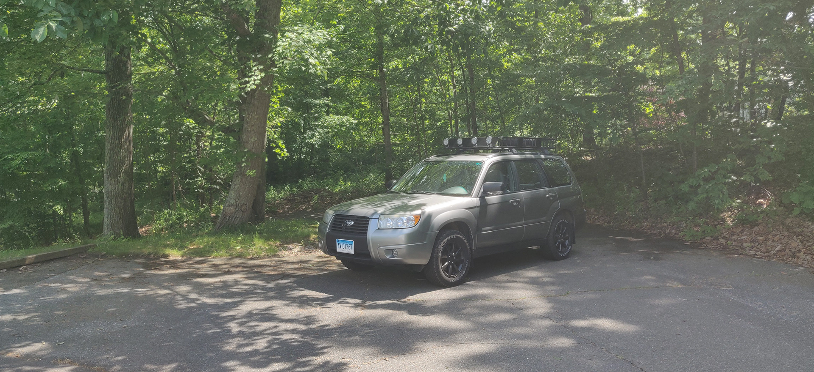
Put Janice to work a bit while doing the picnic table boat project [in the videos section of this site]. It was a blast bringing her to pick up lumber and seeing the looks from guys with large trucks.
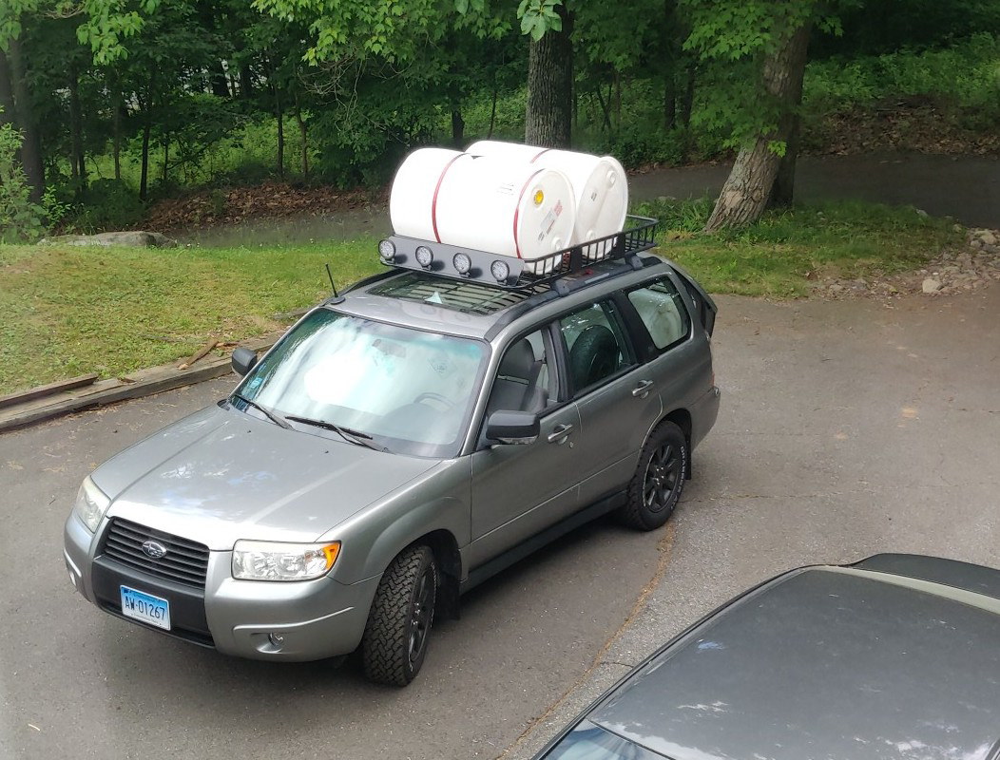

The summer was very hot so I tinted the windows 30% on my own. The door windows were easy to do but I tried and failed with the rears. They will remain untinted until I determine it's worth paying a professional.
The hardest mod of this time was locking the center differential solenoid via wiring around the TCM. After doing it incorrectly the second try again and almost killing the car, I took a break. Eventually was able to complete the mod giving Janice 4wd on demand.
It turned out that a family member had a small vinyl cutter and I was completely unaware! I loved the jdm forester 'f' so I cut some new badges. The rear badges needed some work too so I plastidipped them and added some vinyl mountains. I also planned to add a MtnRoo sticker and my website link, but never got around to learning how to make these complex cuts.

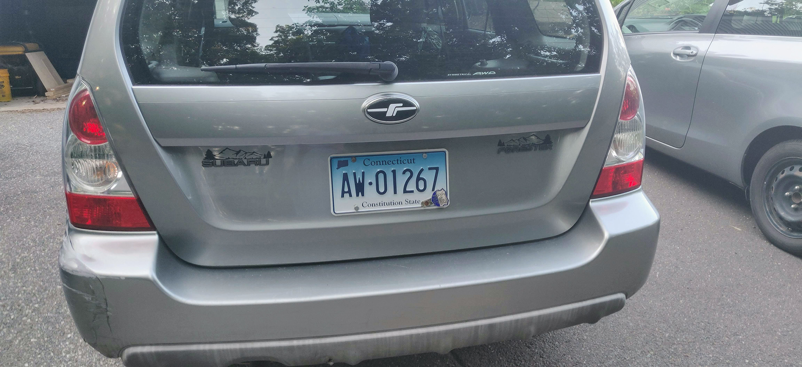

As August came around I really enjoyed modding the car (and even the repairs! :P) but realized there was only so much aftermarket for the forester. I also couldn't justify the money for just shelling out money for a big lift yet. I decided to pick up some fabrication skills and got my first angle grinder. The lift kit was the most important but was put on the backburner because I felt I needed more skills to make proper subframe spacers.
I did not like how bare the hood had looked, so I ordered some air duct vents for very cheap and added hood struts while under there. I past the point of no return on the car when I first cut the holes in the hood to cover with vents. This was the crossing where Janice became Jan, needing a little bit cooler of a name.
The next fab mod was when my brother's jeep had outgrown its bumper and needed a different one to fit its aesthetic. Well guess what we did with the old one?
To make it fit we removed the crash bar from Jan and cut the edges of the jeep bumper to fit over it. We used a 2x4 as a spacer and bolted the bumper into the crash bar. We remounted the the forester and cut the stock bumper to fit over. This got it very scratched in the process but the look was worth it.

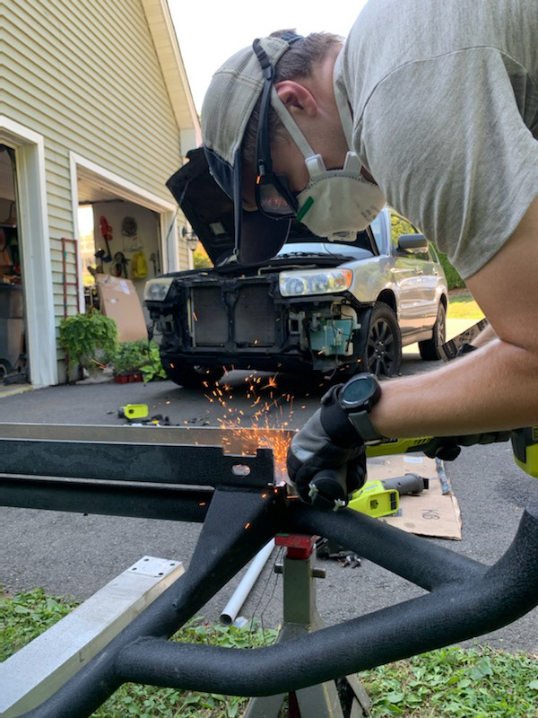

I had planned for this mod since I first got the car with it being so simple but didn't think I had the skills to make it myself. Below are the blueprints for the skid plate that I designed but in reality, they weren't necessary because I eyeballed it by sitting under the car and drawing on the skid plate beside me where to cut. The photo below is not the final version because it required spacers to not press against the exhaust but I was proud of it.
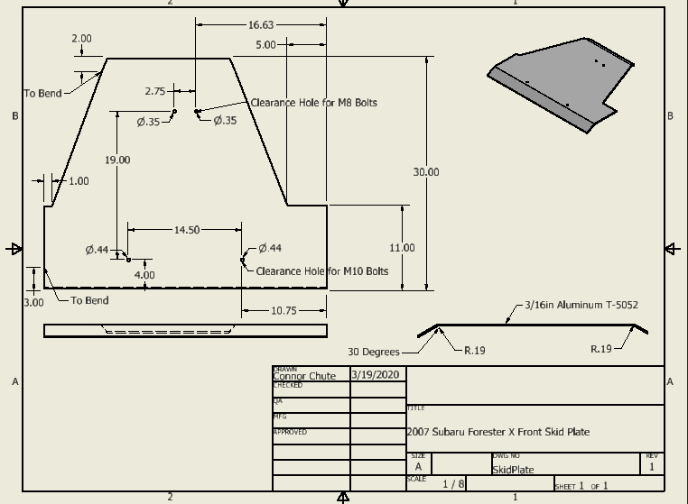
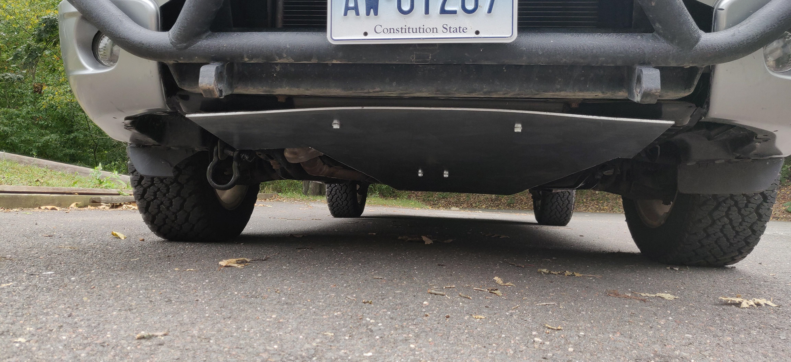
On the same day as the skid plate, I picked up some 4x4 angle aluminum to replace the now cracking skirts. I cut the angle to size and bedlined it, then bolted right into where the clip holes were with some modification to the surrounding trim of course. I added some rubber edgeliner to the top edge and they now function much better than stock and protect the body.
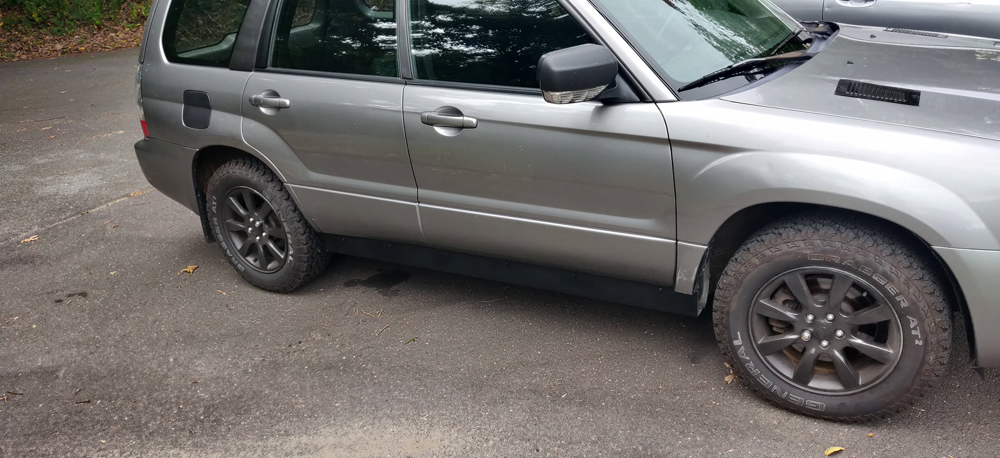

Two days before moving back to university, my snorkel kit finally arrived. I had ordered it 5 months earlier, but US Customs had held onto it for inspection. All I needed to do those two days was an oil change, so I decided to do the snorkel install as well. I used a mitsubishi pajero snorkel as many do, but struggled to get it to fit. Also, I was cutting at the fender without a hole saw, and couldn't even remove it without taking off the bumper assembly.

After finally getting the snorkel attached but not yet molded, I took it for a ride to pick up some lunch. Turns out I didn't do a very good job of tightening the snorkel head hose clamp, so I lost it off the side of the highway. I then decided to ratchet strap the main pipe to the passenger seat until I molded and riveted it in. I ordered a new snorkel head and it came about a week later.
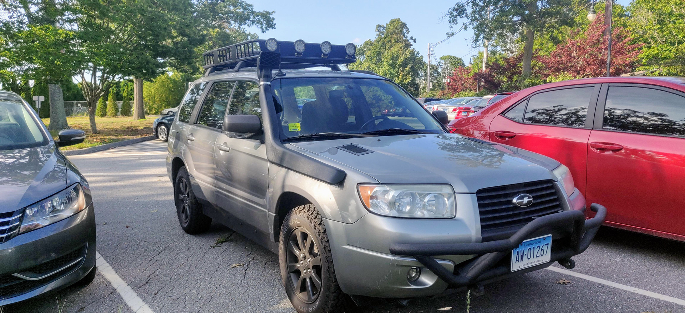
This oil change became the worst oil change anyone could imagine due to Mobil over-tightening the nontraditional sized filter, which took 6 hours to remove, including 4 trips to the auto parts store. I also changed the transmission fluid and filter, but the trans filter was the original on the car - over 14 years old! Ruined a pair of clothes both days but am glad to know she's running right.
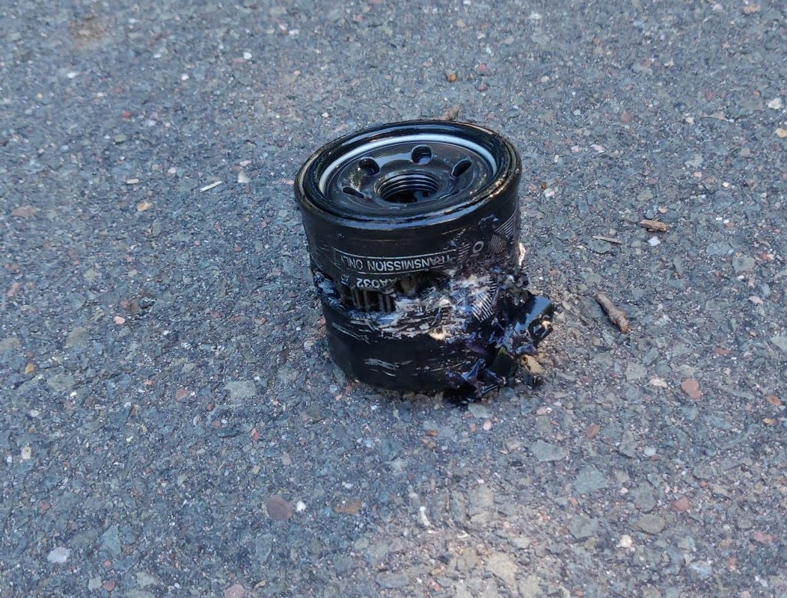
Thought it would be cool to get the forester drawn by @marksdrawingagain and it came out great! Going to make some stickers from these, and he did the jeep as well.

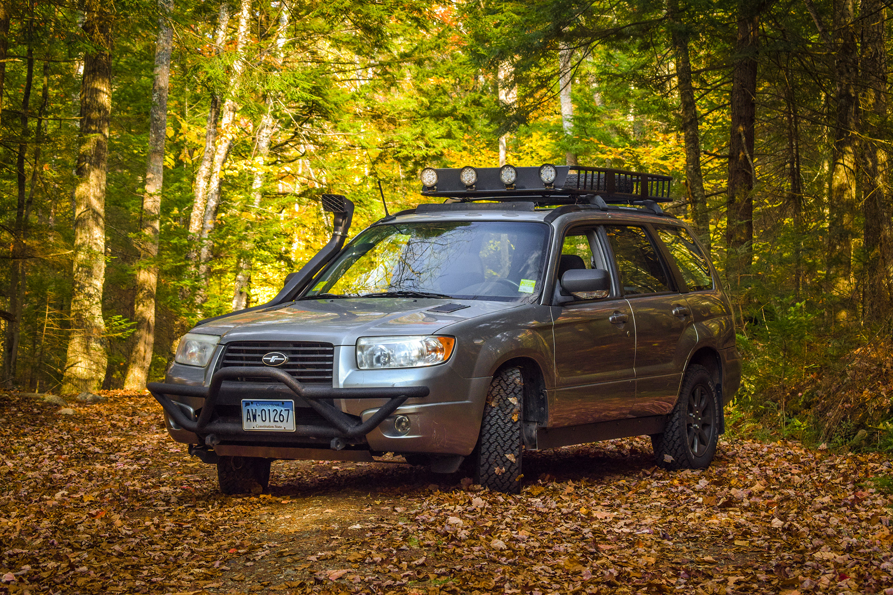
Took the forester on her first real road trip and snapped the picture above. Going into winter, it was apparent that she was too low - it was time to lift.

I purchased a set of feal 441 maxtravel coilovers. While I had these for a while, the car remained at stock height for 8 months. Once I finally found time, I had one week for the installation. I thought it would have taken one day, but being in the rust belt adds quite an extension.

The new coilovers were too tall to fit and were seized, preventing being able to shorten them. After a few days of trying every method imaginable, I had to cut the collars. I did not raise the ride height too much as the sway bars greatly limited the downward travel. I had to replace the endlinks with extended ones.
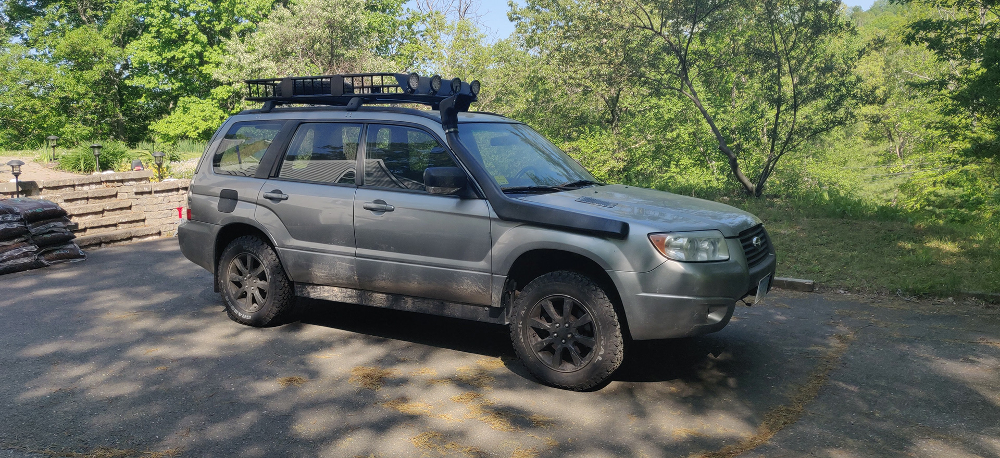

During the install, I accidentally pulled the front passenger cv joint apart. Over the next few weeks I would repeatedly regrease the joint and push the boot back on, but it was clear the axle would have to be removed from the car. This would be a later task. I first decided to tackle the bumper v2, as I had feared the 2x4 breaking and the bumper falling off.

I fabricated a steel adapter for the jeep bumper to mount to the crash bar bolts on the subaru. It went off without much of a hitch and was very strong. I cut the remainder of the front bumper off, making the vehicle much less aerodynamic, albeit cooler looking.
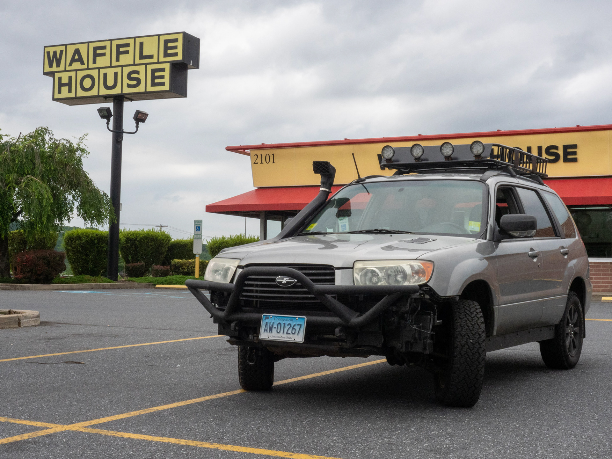
After taking some road trips, the axle got worse and worse. I pulled 2 front axles from a parts car and prepared to do a full replacement. The replacement went cleanly, and the car was set to just ride as it is. I eventually ended up having to repeat this process 4 times.

In Summer 2022, I purchased a 2005 Mini Cooper S Convertible, leaving Jan to have a break. With gas prices over $5, Jan was downgraded to a work car at 170,000 miles.
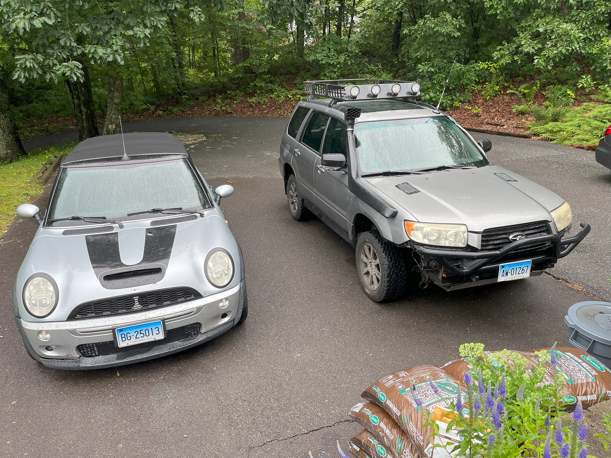

Winter 2022 Jan was once again my daily driver, though suffered from a rainy day and an open window to being filled with water. I removed all the carpets and cleaned out the water, putting in vinegar to prevent any mold. After dehumidifying for over two weeks she was good as new.

Early 2023 I recognized the days of me owning this car are numbered, and as I matured I was getting ready to move on to other projects (and more expensive vehicles). My dream had been to drive Janice on the Bonneville Salt Flats in Utah. My best friend and I made an itinerary and set out in May 2023. The video can be found on my YouTube channel.

Just a few hours in we realized that it would not be possible to make it to Utah in the time we had. We rerouted, the new furthest west destination being Wentzville, MO.

This trip was the last for Jan. I began searching for a new car once we returned, and settled on a Volkswagen Tiguan.

On December 30th, 2023, I sold Jan for $2,000. In the last few months of ownership, an exhaust leak and a steering misalignment developed. And with the new VW, I ran out of space to store it. She was at 180,000 miles.

It was sad to see her go. I loved that car, and the memories made in it will remain with me forever.


